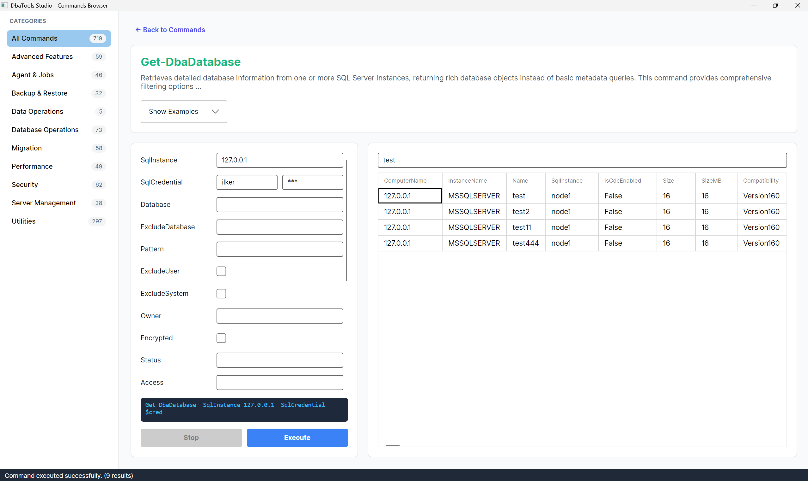

# DbaTools Studio



DbaTools Studio is a cross-platform desktop application built with .NET 8 and Avalonia UI that provides a beautiful, modern graphical interface for [dbatools](https://dbatools.io/). It eliminates the need to remember complex PowerShell commands by offering an interactive way to explore, configure, and execute over 700 SQL Server automation commands.

## Features

* **Modern User Interface**: A clean, intuitive design inspired by the official dbatools documentation, making it easy to find and run commands.
* **Smart Search**: Quickly find the command you need using an optimized fuzzy search that searches across command names and descriptions.
* **Dynamic Forms**: Select any command and the application will dynamically generate an input form based on its PowerShell parameters (supporting strings, integers, switches, and PSCredentials).
* **Real-time Command Preview**: As you fill out the form, watch the exact PowerShell command being built in real-time before you execute it.
* **Offline Support**: Command metadata is seamlessly cached and accessible even if you don't have an active internet connection.
* **Cancel Execution**: Safe execution handling with the ability to stop long-running database queries and tasks at the click of a button.
* **Result DataGrid**: Easily browse, sort, and filter command outputs in a structured table format.

## Prerequisites

* [.NET 8.0 SDK](https://dotnet.microsoft.com/download/dotnet/8.0) (or runtime)
* Windows PowerShell / PowerShell Core
* The `dbatools` module installed (`Install-Module dbatools -Force`)

## How to Run

1. Clone or download this repository.
2. Open a terminal and navigate to the project directory:
   ```bash
   cd DbaToolsStudio
   ```
3. Run the application:
   ```bash
   dotnet run
   ```

## Usage

1. **Browse Categories**: Use the left sidebar to navigate commands by category (e.g., Backup & Restore, Migration, Security).
2. **Search**: Use the search box to find a specific command (e.g., "remove database").
3. **Configure**: Click on a command card to open the detail view. Fill in the required parameters (marked in red with an asterisk).
4. **Examples**: Click "Show Examples" to view real-world usage examples pulled directly from the command's documentation.
5. **Execute**: Click the **Execute** button to run the command. The output will be displayed in the results table below.
6. **Cancel**: If a command is taking too long, click the **Stop** button to cancel the execution safely.

## Technologies Used

* **C# / .NET 8** - Core framework
* **Avalonia UI** - Cross-platform UI framework
* **System.Management.Automation** - PowerShell SDK integration

